# HỆ THỐNG REPLAY - KHÔI PHỤC VÀ TÁI XỬ LÝ DỮ LIỆU
## TỔNG QUAN
**Replay System** là một hệ thống phụ trợ quan trọng cho phép tái xử lý toàn bộ hoặc một phần dữ liệu lịch sử từ **S3 Event Store**. Đây là thành phần then chốt đảm bảo tính **immutable** và **reproducible** của toàn bộ hệ thống Identity Resolution.
### Vai trò chính:
- **Disaster Recovery**: Khôi phục hệ thống sau sự cố
- **Algorithm Updates**: Áp dụng thuật toán mới cho dữ liệu lịch sử
- **Data Correction**: Sửa lỗi xử lý dữ liệu
- **Historical Analysis**: Phân tích lại dữ liệu với góc nhìn mới

## KIẾN TRÚC REPLAY SYSTEM
### **Thành phần chính:**
#### **1. Replay Controller (Lambda Function)**
- **Vai trò**: Điều khiển trung tâm của quá trình replay
- **Chức năng**:
    - Nhận yêu cầu replay từ external triggers
    - Phân tích scope và requirements
    - Tạo execution plan
    - Khởi tạo replay jobs
    - Monitoring và status reporting

#### **2. SQS Queue (Replay Jobs)**
- **Vai trò**: Quản lý hàng đợi các job replay
- **Chức năng**:
    - Batch processing management
    - Job prioritization
    - Error handling và retry logic
    - Dead letter queue cho failed jobs

#### **3. Step Functions (Replay Orchestration)**
- **Vai trò**: Điều phối toàn bộ quá trình replay
- **Chức năng**:
    - State machine management
    - Parallel processing coordination
    - Error recovery workflows
    - Progress tracking và rollback

## LUỒNG HOẠT ĐỘNG REPLAY
### **Phase 1: Initiation (Khởi tạo)**
#### **Trigger Sources:**
- **Manual Trigger**: Admin/DevOps team khởi động
- **Scheduled Trigger**: Cron jobs định kỳ
- **Event-Driven Trigger**: Phát hiện corruption hoặc anomaly
- **API Trigger**: Từ monitoring systems
- **Algorithm Update**: Khi có thuật toán mới

#### **Process Flow:**
``` 
External Trigger → Replay Controller → 
Validate Request → Create Execution Plan → 
Initialize Replay Jobs
```
### **Phase 2: Planning (Lập kế hoạch)**
#### **Replay Controller thực hiện:**
1. **Scope Analysis**:
    - Xác định time range cần replay
    - Ước lượng data volume
    - Tính toán resource requirements

2. **Execution Strategy**:
    - Chọn parallel processing level
    - Xác định batch size
    - Thiết lập priority ordering

3. **Resource Allocation**:
    - Scale up EMR clusters
    - Prepare staging areas
    - Setup monitoring

### **Phase 3: Execution (Thực thi)**
#### **Job Distribution:**
``` 
Replay Controller → SQS Queue → 
Step Functions → Parallel Processing
```
#### **Step Functions Workflow:**
1. **Data Partitioning**:
    - Chia data theo time partitions
    - Tạo parallel execution paths
    - Load balancing across resources

2. **Processing Orchestration**:
    - Trigger multiple Glue ETL jobs
    - Coordinate EMR cluster processing
    - Manage dependencies between jobs

3. **Progress Monitoring**:
    - Track completion status
    - Monitor resource utilization
    - Error detection và handling

### **Phase 4: Data Access (Truy cập dữ liệu)**
#### **Reading from S3 Event Store:**
``` 
Step Functions → Read S3 Events → 
Glue ETL Jobs → EMR Cluster Processing
```
#### **Access Pattern:**
- **Sequential Reading**: Theo time partitions
- **Parallel Processing**: Multiple EMR tasks
- **Batch Processing**: Optimize I/O operations
- **Memory Management**: Efficient data streaming

## KỊCH BẢN SỬ DỤNG
### **1. Algorithm Update Replay**
**Tình huống**: Cập nhật thuật toán identity resolution mới

**Luồng xử lý**:
``` 
New Algorithm Deployed → Replay Controller → 
Historical Data Processing → Updated Results → 
Validation → Production Deployment
```
**Đặc điểm**:
- **Scope**: Toàn bộ dữ liệu lịch sử
- **Priority**: Medium (có thể chạy background)
- **Validation**: So sánh kết quả cũ và mới
- **Rollback**: Giữ lại phiên bản cũ cho rollback

### **2. Disaster Recovery Replay**
**Tình huống**: Database corruption hoặc data loss

**Luồng xử lý**:
``` 
Corruption Detected → Emergency Replay → 
Parallel Processing → Rebuild Databases → 
Integrity Validation → Switch to New System
```
**Đặc điểm**:
- **Scope**: Dữ liệu bị ảnh hưởng
- **Priority**: Critical (highest priority)
- **Speed**: Maximum parallel processing
- **Validation**: Comprehensive integrity checks

### **3. Data Correction Replay**
**Tình huống**: Phát hiện lỗi trong xử lý dữ liệu

**Luồng xử lý**:
``` 
Bug Identified → Fix Deployed → Selective Replay → 
Affected Data Reprocessing → Correction Applied
```
**Đặc điểm**:
- **Scope**: Specific time range hoặc data subset
- **Priority**: Medium to High
- **Precision**: Chính xác định vị lỗi
- **Minimal Impact**: Không ảnh hưởng production

### **4. Historical Analysis Replay**
**Tình huống**: Phân tích lại dữ liệu với business logic mới

**Luồng xử lý**:
``` 
Analysis Request → Custom Processing Logic → 
Replay with New Rules → Generate Insights → 
Business Reports
```
**Đặc điểm**:
- **Scope**: Specific time periods
- **Priority**: Low (background processing)
- **Flexibility**: Custom processing logic
- **Output**: Analytical datasets

## KẾT LUẬN
**Replay System** là backbone của **Data Reliability** trong hệ thống Identity Resolution. Nó đảm bảo:
- **Zero Data Loss**: Không bao giờ mất dữ liệu
- **Complete Reproducibility**: Tái tạo hoàn toàn
- **Continuous Improvement**: Cải tiến liên tục
- **Disaster Recovery**: Khôi phục nhanh chóng

Hệ thống này biến **S3 Event Store** từ một simple storage thành một **powerful time machine** cho phép doanh nghiệp quay lại bất kỳ thời điểm nào trong quá khứ và xây dựng lại toàn bộ state của hệ thống.
