# HỆ THỐNG IDENTITY RESOLUTION
## TỔNG QUAN KIẾN TRÚC
Hệ thống được thiết kế theo mô hình **Lambda Architecture** với 3 tầng chính và 1 hệ thống phụ trợ, tạo thành một kiến trúc hoàn chỉnh cho việc thu thập, xử lý và truy vấn dữ liệu nhận dạng khách hàng.

## LUỒNG DỮ LIỆU
### **Giai đoạn 1: Thu thập Dữ liệu (TIER 1)**
#### **Nguồn khởi đầu:**
- **Web Apps**: Tương tác trên website
- **Mobile Apps**: Hành vi trên ứng dụng di động
- **CRM Systems**: Dữ liệu quản lý khách hàng
- **POS Systems**: Giao dịch tại điểm bán hàng
- **Chatbots**: Hội thoại với khách hàng

#### **Luồng xử lý:**
1. **API Gateway**
    - Tiếp nhận tất cả yêu cầu
    - Thực hiện rate limiting và authentication
    - Điểm vào duy nhất cho toàn bộ hệ thống

2. **Kinesis Data Streams**
    - Nhận events theo thời gian thực
    - Phân tán dữ liệu cho xử lý song song
    - Đảm bảo durability và ordering

3. **EventBridge**
    - Đóng vai trò schema registry
    - Chuẩn hóa định dạng sự kiện
    - Routing events theo loại

4. **Lambda Validator**
    - Kiểm tra tính hợp lệ của dữ liệu
    - Bổ sung metadata
    - Làm sạch dữ liệu không hợp lệ

5. **Kinesis Data Firehose**
    - Gom nhóm events theo batch
    - Tự động nén và định dạng
    - Ghi vào S3 Event Store

6. **S3 Event Store**
    - Lưu trữ immutable events
    - Phân vùng theo date/hour
    - "Single source of truth"

#### **Đặc điểm quan trọng:**
- **Immutable**: Dữ liệu không bao giờ bị thay đổi
- **Partitioned**: Tối ưu hiệu năng truy vấn
- **Durable**: Không bao giờ mất dữ liệu
- **Scalable**: Tự động mở rộng theo tải

### **Giai đoạn 2: Xử lý Dữ liệu (TIER 2)**
#### **Speed Layer - Xử lý Tức thì**
**Mục đích:** Cung cấp kết quả nhanh chóng cho nhu cầu kinh doanh khẩn cấp

**Luồng xử lý:**
1. **Kinesis Analytics**
    - Nhận stream data từ Kinesis Data Streams
    - Chạy SQL queries theo thời gian thực
    - Phát hiện patterns và anomalies

2. **Lambda Processor**
    - Thực hiện thuật toán identity resolution đơn giản
    - Xử lý real-time linking
    - Tạo temporary identity connections

3. **DynamoDB Speed**
    - Lưu trữ kết quả tốc độ cao
    - TTL 24 giờ
    - Optimized cho single-item lookups

4. **ElastiCache Speed**
    - Cache hot data
    - Sub-millisecond latency
    - Shared across multiple processes

**Đặc điểm:**
- **Latency**: 100ms - 1 giây
- **Accuracy**: 80-85% (trade-off với tốc độ)
- **TTL**: 24 giờ
- **Refresh**: Liên tục

#### **Batch Layer - Xử lý Toàn diện**
**Mục đích:** Xử lý toàn bộ dữ liệu lịch sử với độ chính xác cao

**Luồng xử lý:**
1. **S3 Event Notifications**
    - Trigger khi có file mới
    - Tạo processing queue
    - Batch processing initiation

2. **AWS Glue**
    - Crawl và catalog dữ liệu
    - Chạy ETL jobs
    - Schema evolution management

3. **EMR Cluster**
    - Xử lý large-scale data với Spark
    - Chạy machine learning algorithms
    - Complex identity resolution

4. **S3 Master Dataset**
    - Lưu trữ processed data
    - Định dạng Parquet
    - Optimized cho analytics

**Đặc điểm:**
- **Latency**: 1-6 giờ
- **Accuracy**: 95-99%
- **Volume**: Hàng triệu records
- **Frequency**: Hàng ngày/tuần

#### **Serving Layer - Tổng hợp Kết quả**
**Mục đích:** Kết hợp kết quả từ Speed và Batch layer

**Luồng xử lý:**
1. **View Materializer**
    - Merge dữ liệu từ cả hai layer
    - Resolve conflicts
    - Create unified views

2. **Neptune Graph Store**
    - Lưu trữ identity graph
    - Relationship queries
    - Graph algorithms

3. **DynamoDB Batch**
    - Unified customer profiles
    - High-performance lookups
    - Consistent reads

**Đặc điểm:**
- **Best of both worlds**: Tốc độ và độ chính xác
- **Real-time sync**: Cập nhật liên tục
- **Comprehensive**: Dữ liệu đầy đủ
- **Optimized**: Cho mọi loại query

### **Giai đoạn 3: Truy vấn Dữ liệu (TIER 3)**
#### **API Layer**
1. **GraphQL API**
    - Complex queries với relationships
    - Flexible data fetching
    - Real-time subscriptions

2. **REST API**
    - CRUD operations đơn giản
    - RESTful conventions
    - Easy integration

#### **Optimization Layer**
1. **Query Router**
    - Phân tích query complexity
    - Chọn data source tối ưu
    - Load balancing

2. **ElastiCache Query Cache**
    - Cache kết quả query phổ biến
    - TTL-based invalidation
    - Distributed caching

3. **Neptune Read Replicas**
    - Phân tán read workload
    - Geographic distribution
    - High availability

4. **DynamoDB DAX**
    - Microsecond latency
    - Write-through caching
    - Automatic scaling

#### **Đặc điểm:**
- **Response Time**: <5ms (cached), <50ms (uncached)
- **Accuracy**: 100% (from serving layer)
- **Availability**: 99.99%
- **Scalability**: Auto-scaling

## ĐẶC ĐIỂM KỸ THUẬT
### **Chỉ số Hiệu năng**

| Metrics | Value | Description |
| --- | --- | --- |
| **Ingestion** | 50,000 events/sec | Khả năng thu thập |
| **Real-time** | <100ms | Xử lý tức thì |
| **Batch** | 6h SLA | Xử lý toàn diện |
| **Query** | <5ms cached | Truy vấn nhanh |
| **Graph** | <200ms | Quan hệ phức tạp |
### **Tính năng Mở rộng**
#### **Auto-scaling Components:**
- Lambda Functions
- DynamoDB Tables
- Kinesis Streams
- ElastiCache Clusters

#### **Manual-scaling Components:**
- EMR Clusters
- Neptune Instances
- RDS Read Replicas

#### **Unlimited Components:**
- S3 Storage
- API Gateway
- CloudFront CDN

### **Độ chính xác Dữ liệu**

| Layer | Accuracy | Latency | Use Case |
| --- | --- | --- | --- |
| **Speed** | 80-85% | 100ms | Real-time decisions |
| **Batch** | 95-99% | 6 hours | Comprehensive analysis |
| **Serving** | Best of both | Variable | Production queries |
| **Replay** | 100% | Hours | Recovery & improvements |
### **Bảo mật và Tuân thủ**
#### **Encryption:**
- **At Rest**: KMS encryption cho tất cả storage
- **In Transit**: TLS 1.3 cho tất cả communications
- **Keys**: Automatic key rotation

#### **Access Control:**
- **IAM Roles**: Least privilege principle
- **API Keys**: Rotating credentials
- **VPC**: Network isolation

#### **Compliance:**
- **GDPR**: Right to be forgotten
- **CCPA**: California privacy compliance
- **SOC2**: Security controls
- **Audit Trail**: Complete lineage

### **Tính khả dụng Cao**
#### **Multi-AZ Deployment:**
- All components deployed across AZs
- Automatic failover
- Health monitoring

#### **Disaster Recovery:**
- Cross-region replication
- Automated backups
- Point-in-time recovery
- Complete system rebuild

#### **Monitoring:**
- CloudWatch metrics
- X-Ray tracing
- Automated alerts
- Performance dashboards

## ĐIỂM NỔI BẬT KIẾN TRÚC
### **1. Kho lưu trữ Sự kiện Bất biến**
- **Permanent Storage**: Mọi tương tác được lưu vĩnh viễn
- **Never Lose Data**: Không bao giờ mất dữ liệu
- **Replay Capability**: Tái tạo bất kỳ thời điểm nào
- **Compliance Foundation**: Nền tảng cho audit và tuân thủ

### **2. Lambda Architecture**
- **Speed Layer**: Nhanh nhưng xấp xỉ
- **Batch Layer**: Chậm nhưng chính xác
- **Serving Layer**: Tốt nhất của cả hai layer trên
- **Flexibility**: Cân bằng tốc độ và độ chính xác

### **3. Truy cập Dữ liệu Đa phương thức**
- **GraphQL**: Truy vấn phức tạp với relationships
- **REST**: CRUD operations đơn giản
- **Direct S3**: Data science và analytics
- **Graph DB**: Phân tích mạng lưới

### **4. Caching Thông minh**
- **Multi-tier Strategy**: Nhiều tầng cache
- **Smart Invalidation**: Dựa trên data changes
- **Performance Boost**: Cải thiện đáng kể độ trễ
- **Cost Optimization**: Giảm database load

### **5. Hệ thống Tự phục hồi**
- **Point-in-time Recovery**: Khôi phục bất kỳ lúc nào
- **Auto Recovery**: Tự động khôi phục từ lỗi
- **Continuous Improvement**: Cải tiến liên tục, thay đổi thuật toán nhận diện
- **Zero Data Loss**: Không mất dữ liệu
